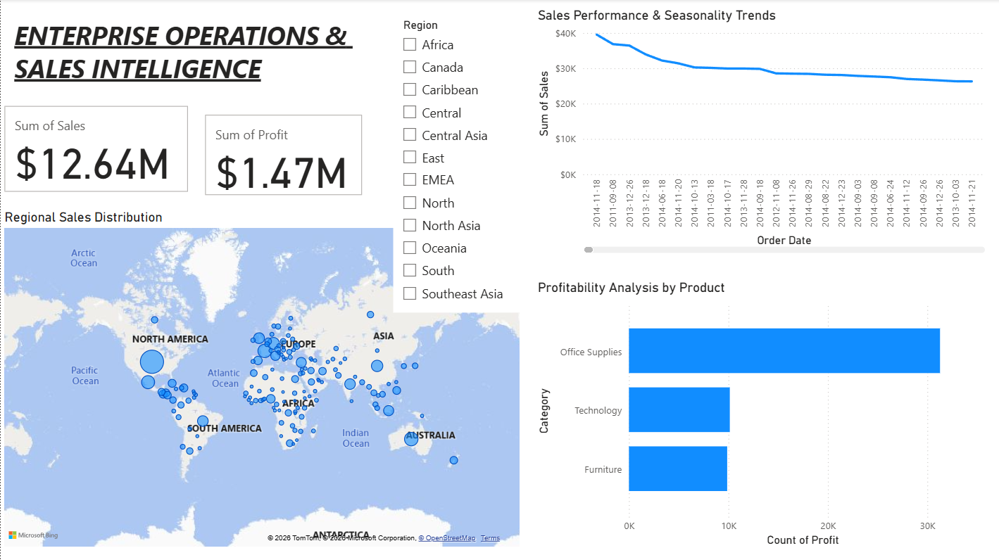
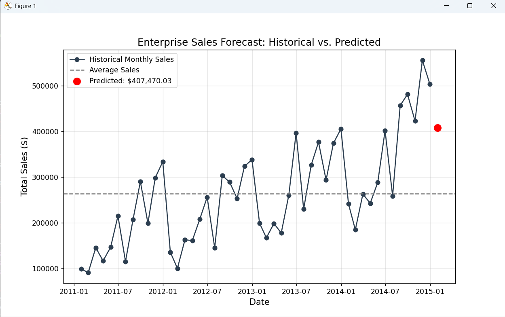

# 📊 Enterprise Operations Analytics Dashboard

End-to-end data engineering and analytics pipeline. Features a Python ETL process, SQL-based Star Schema modeling, and a Power BI executive dashboard for global sales and operations tracking.
Validated a Linear Regression model in Python, forecasting a next-month sales target of $407.4k based on historical seasonality and regional trends.

### 📈 Machine Learning Forecast
Below is the output from the `forecast_model.py` script, predicting next-month sales using Linear Regression:

